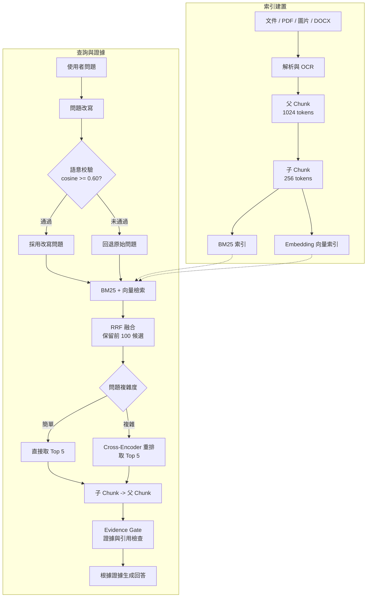

# 泛用 RAG 工作台

本機優先的多格式 RAG 系統。文件、知識庫、Embedding、重排模型與回答模型都可以替換，適合用來做企業文件問答與檢索實驗。

[線上介面展示](https://ryan1998-0.github.io/Universal-RAG/rag-demo/)｜本機問答介面：`http://127.0.0.1:8765/`

## 核心功能

- 多格式匯入：PDF、掃描 PDF、圖片、DOCX、TXT、Markdown、JSON，支援 OCR。
- 父子 Chunk：用小型子 Chunk 做精準檢索，再回傳較完整的父 Chunk 作為證據。
- 混合檢索：BM25 關鍵字檢索與 Embedding 向量檢索，以 RRF 融合排名。
- 問題理解：問題改寫、語意相似度校驗，以及簡單／複雜問題路由。
- 智慧重排：簡單問題直接取 Top 5；複雜問題才使用 Cross-Encoder 重排。
- 證據約束：Evidence Gate、來源引用、證據不足拒答，降低模型幻覺。
- 企業功能：知識庫與資料夾管理、文件 ACL、SQLite 對話記憶與可替換模型後端。
- 模型選擇：預設可使用 Ollama Qwen；也支援 LangChain、OpenAI、Anthropic 與 GPT-5.5 子代理。

## 新版 RAG 架構



目前優化版的關鍵設定如下：

| 項目 | 設定 |
| --- | --- |
| Chunk | 父 1024 tokens、子 256 tokens |
| 混合檢索 | BM25 + Embedding，RRF `k=60` |
| 候選與證據 | 前 100 候選，最終 Top 5 |
| 重排 | 複雜問題使用 Cross-Encoder |
| 改寫校驗 | 原始問題與改寫問題 cosine similarity 至少 `0.60` |

完整節點說明見[核心架構流程](docs/hybrid_rag_architecture_flow.md)，專案管理入口為 `http://127.0.0.1:8765/architecture.html`。

## 測試報告

### MultiHop-RAG 全量檢索

使用 2,556 題與 609 份文件，只執行到證據檢索，不呼叫回答模型。結果分為無優化版與全優化版：

| 版本 | Gold fact recall | 任一證據命中 | 完整證據命中 | 首個證據命中 | P95 延遲 | 模型呼叫 |
| --- | ---: | ---: | ---: | ---: | ---: | ---: |
| 無優化版 | 57.59% | 92.86% | 28.69% | 79.65% | 574.4 ms | 0 |
| 全優化版 | 94.40% | 99.96% | 86.47% | 99.07% | 4,264.0 ms | 0 |

指標只計算 2,255 題有 Gold evidence 的題目，301 題 `null_query` 不列入分母：

- 任一證據命中：Top 5 合併後包含至少一個 Gold fact。
- 完整證據命中：Top 5 合併後包含該題全部 Gold facts。
- 首個證據命中：Top 5 中至少有一個單獨 Chunk 包含 Gold fact；不是只檢查 Rank 1。

完整結果：[逐題結果](evals/multihop_rag_retrieval_full/retrieval-full-results.json)｜[彙整報告](evals/multihop_rag_retrieval_full/retrieval-full-report.md)｜[摘要](evals/multihop_rag_retrieval_full/retrieval-full-summary.json)

重跑指令：

```powershell
$env:RAG_CROSS_ENCODER_BATCH_SIZE="100"
uv run --extra production python scripts/run_multihop_retrieval_full_eval.py --cross-encoder-model jinaai/jina-reranker-v1-tiny-en
```

### 其他驗證

- Python 單元與整合測試：`229 passed`。
- IFRS 17 100 題檢索基準：[結果摘要](docs/results_summary.md)。
- 全部評測指標都以檢索召回與延遲為主；回答正確率與幻覺率需另跑回答模型評測。

## RAG 資料庫來源

本專案的知識庫可替換；目前測試與示範資料來源如下：

| 用途 | 公開來源 | 本機用途 |
| --- | --- | --- |
| MultiHop-RAG 全量題庫 | [yixuantt/MultiHop-RAG](https://github.com/yixuantt/MultiHop-RAG) | 2,556 題、609 份新聞文件，用於本次全量檢索評測 |
| IFRS 17 範例知識庫 | [IFRS Foundation](https://www.ifrs.org/issued-standards/list-of-standards/ifrs-17-insurance-contracts/) | `profiles/ifrs17/`，來源清單與雜湊值見 `corpus_manifest.json` |
| 勞動基準法範例 | [勞動部勞動法令查詢系統](https://laws.mol.gov.tw/FLAW/PrintFLAWDAT0201.aspx?id=FL014930&ldate=20240731) | 勞基法 50 題檢索與消融測試 |
| LegalBench-RAG | [ZeroEntropy-AI/legalbenchrag](https://github.com/ZeroEntropy-AI/legalbenchrag) | 法律文件 RAG benchmark |
| EnterpriseRAG-Bench | [onyx-dot-app/EnterpriseRAG-Bench](https://github.com/onyx-dot-app/EnterpriseRAG-Bench) | 企業文件 RAG benchmark |
| Open RAG Benchmark | [vectara/open-rag-bench](https://github.com/vectara/open-rag-bench) | PDF 文件 RAG benchmark |
| Fujitsu RAG Hard Benchmark | [FujitsuResearch/Fujitsu-RAG-Hard-Benchmark](https://github.com/FujitsuResearch/Fujitsu-RAG-Hard-Benchmark) | 多跳與困難題型 benchmark |

MultiHop-RAG 的原始檔位於本機評測目錄 `RAG測試題庫/01_MultiHop-RAG/`；原始資料的授權條件依各公開來源為準。

## 本機啟動

需要 Python 3.12 與 [Ollama](https://ollama.com/)：

```bash
git clone https://github.com/Ryan1998-0/Universal-RAG.git
cd Universal-RAG
uv sync --extra production
ollama pull qwen2.5:7b
uv run --extra production python -m rag_demo.web_app
```

啟動後開啟 `http://127.0.0.1:8765/`。LangChain 是可選模型介面，安裝 `uv sync --extra langchain` 後設定 `RAG_MODEL_BACKEND=langchain` 即可。

## 延伸文件

- [專案總覽](docs/project_overview_zh.md)
- [文件處理與 OCR](docs/multimodal-ingestion-pipeline.md)
- [文件查詢 ACL](docs/query_access_control.md)
- [正式部署目標](docs/production-ready-rag-target.md)
