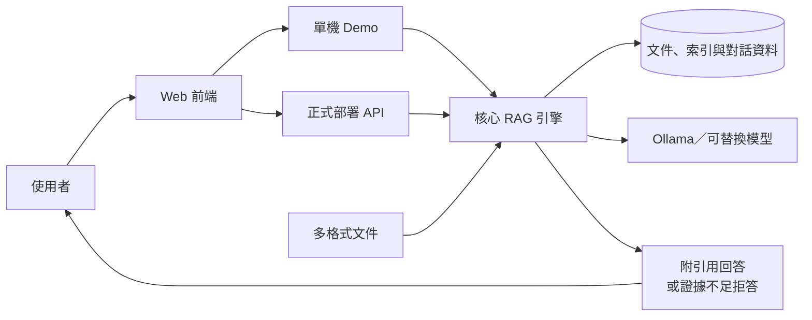
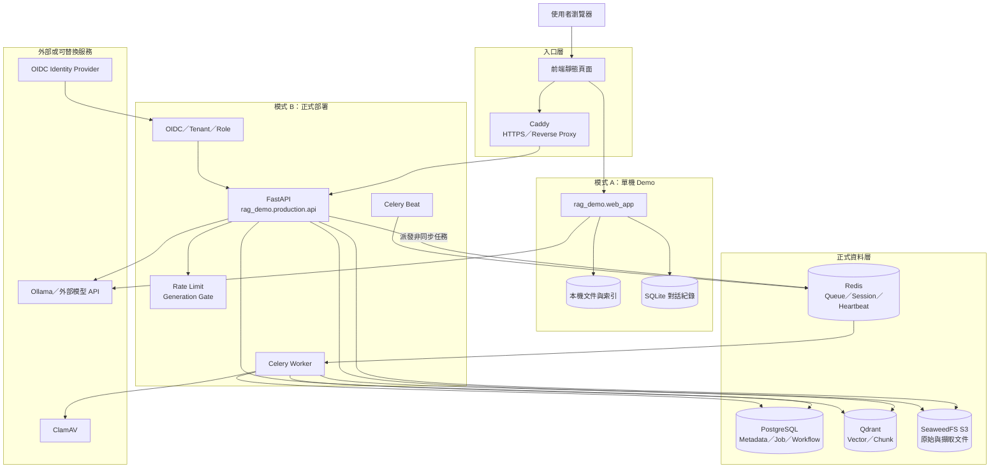
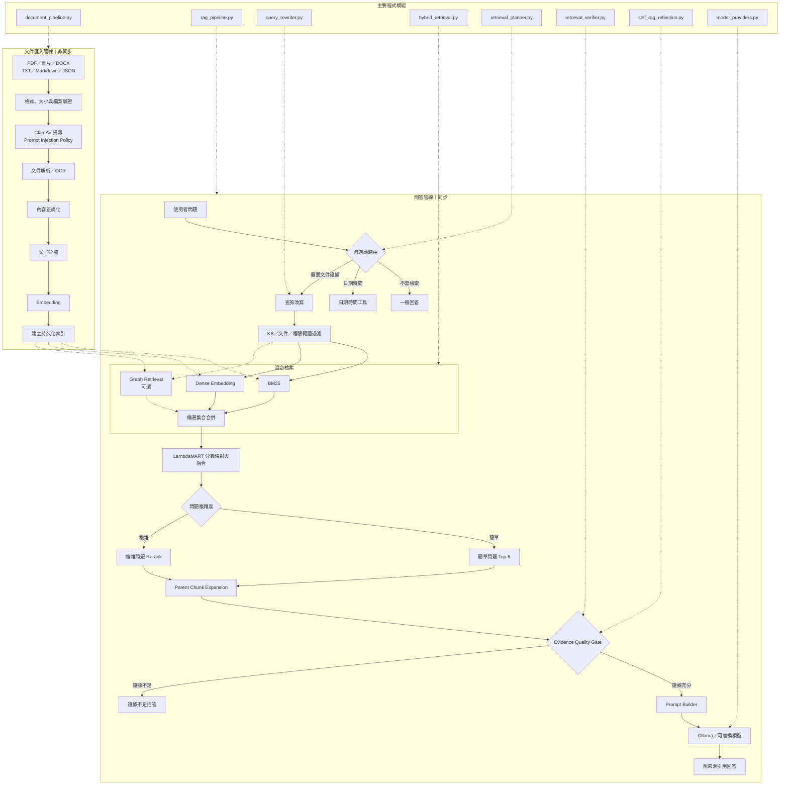

# Universal-RAG 分層架構圖

本文以三種顆粒度描述系統：L1 適合對外簡報，L2 適合系統設計與部署，L3 適合開發、追蹤資料流與除錯。

## L1：系統全景圖

這一層只回答使用者、RAG 系統、文件、資料與模型之間如何互動。

## L2：服務與基礎設施圖

這一層呈現單機與正式部署的差異，以及服務、背景任務與資料儲存之間的依賴關係。

## L3：RAG 處理管線與模組圖

## 使用方式

- L1：對外介紹專案定位與核心價值。
- L2：說明部署架構、服務依賴與資料儲存。
- L3：追蹤文件匯入與問答過程，並對應實際 Python 模組。
