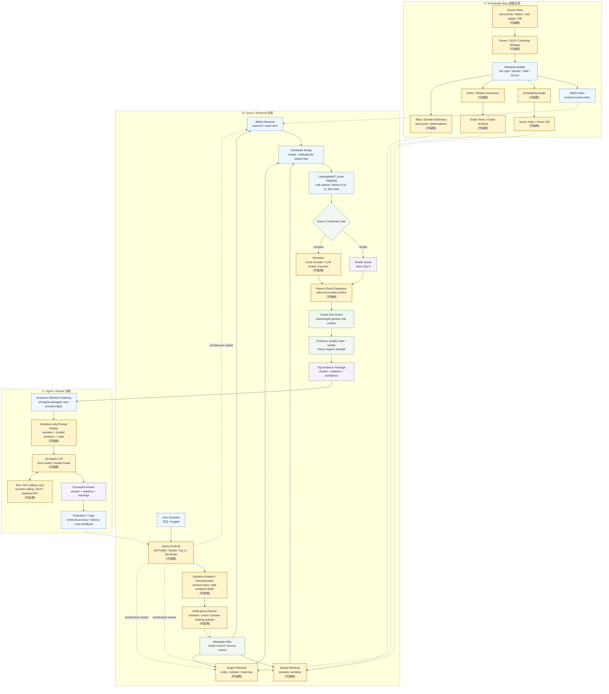

# 完整 Hybrid RAG / Agent 架構流程圖

這張圖不綁定特定資料庫，呈現的是可重複套用到不同 knowledge base 的完整 RAG / Agent 架構。標記 `[可抽換]` 的節點代表可以依照資料類型、成本、模型能力或部署方式替換。

## 節點說明

| 節點 | 作用 |
| --- | --- |
| Source Data `[可抽換]` | 可以換成不同領域文件、資料表、網頁、PDF 或資料庫。 |
| Parser / OCR / Chunking Strategy `[可抽換]` | 依資料格式決定解析方式與 chunk size。 |
| Embedding Model `[可抽換]` | Dense Retrieval 的語意表示模型，可換成本機或雲端 embedding。 |
| Vector Index / Vector DB `[可抽換]` | 儲存向量與相似度搜尋結果，可依部署條件替換。 |
| Entity / Relation Extraction `[可抽換]` | 建立 Graph 前的實體與關係抽取策略。 |
| Graph Store / Graph Schema `[可抽換]` | Graph 的資料庫與 schema，可依資料關係複雜度調整。 |
| Query Controls `[可抽換]` | 可選 knowledge base profile、retrieval variant、top_k、QA model。 |
| Question Analysis / Decomposition `[可抽換]` | 解析目前問題及必要的對話省略，拆出要由證據回答的對象、條件、數值、期間或程序。 |
| Multi-query Planner `[可抽換]` | 產生完整語意、精確詞彙與答案承載詞等互補查詢，分別召回後再融合。 |
| Metadata Filter | 先用文件類型、章節、時間、權限或 profile 縮小檢索範圍。 |
| BM25 Retrieval | 保留關鍵字、條文號、專有名詞等 lexical signal。 |
| Dense Retrieval `[可抽換]` | 補強語意相似、改寫題、同義詞與非原文措辭問題。 |
| Graph Retrieval `[可抽換]` | 用 entity / relation 補強關係型、多跳型問題。 |
| Candidate Merge | 把 BM25、Dense、Graph 的候選結果合併與去重，保留排名作為診斷與 tie-break。 |
| LambdaMART Score Mapping | 將 BM25 與 Dense 分數分開映射到 `[0, 1]`，再依設定權重融合；未提供標註模型時使用單調 rank mapping。 |
| Query Complexity Gate | 只用目前問題與檢索規劃做低延遲判斷；簡單問題直接取 Top-5，複雜問題才執行 Cross-Encoder。 |
| Reranker `[可抽換]` | 在 merge 後重新排序 evidence，可換成 cross-encoder、LLM rerank 或 heuristic rerank。 |
| Parent Chunk Expansion `[可抽換]` | 補上命中 chunk 的前後文，避免 evidence 被切太碎。 |
| Graph Hub Guard | 壓低泛用 hub entity 造成的 graph noise。 |
| Evidence Quality Gate / Verifier | 檢查 evidence 是否足以支撐回答，信心不足時可要求轉人工或回答不知道。 |
| Evidence Attention Ordering | 不改模型權重；將最高排名證據交錯放到 prompt 前後緣，降低長上下文中段遺失。 |
| Evidence-only Prompt Builder `[可抽換]` | 將檢索內容標成唯一可信證據，要求每個實質主張附直接支持的 rank；證據不足必須拒答。 |
| QA Agent LLM `[可抽換]` | 最後生成答案的模型，可以換成本機模型、雲端模型或後端預設模型。 |
| Tool / API Calling Layer `[可抽換]` | Agent 需要外部工具時，可透過 function calling、MCP 或 backend API 呼叫。 |
| Evaluation / Logs | 記錄 retrieval accuracy、latency、使用者回饋，回頭調整各節點。 |

## 架構 Variant

- BM25-only：只走 BM25 Retrieval。
- BM25 + Dense：走 BM25 Retrieval、Dense Retrieval、Candidate Merge，再做 LambdaMART Score Mapping。
- BM25 + Dense + Graph：走三條 retrieval branch，合併後再做 LambdaMART Score Mapping。
- Full stack lab：Query Rewrite、Metadata Filter、BM25、Dense、Graph、Candidate Merge、LambdaMART Score Mapping、Query Complexity Gate、Reranker、Parent Chunk Expansion、Graph Hub Guard、Evidence Quality Gate、QA Agent 全部啟用。
