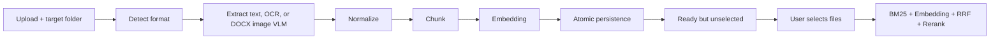

# 多格式文件 Ingestion Pipeline

## 目標

本機 RAG 可接收 PDF、圖片、DOCX、TXT、Markdown 與 JSON。上傳後先完成內容抽取、切塊、Embedding 與持久化；新上傳文件預設不參與問答，由使用者在右側文件面板勾選後，才會進入該次 RAG 檢索。

這是一個兩階段流程：

1. `Upload pool`：已轉換、已建立索引，可重複使用。
2. `Active RAG set`：目前勾選、允許參與查詢的文件集合。

切換勾選狀態只會改變 query-time filter，不會重做 Embedding。

## 虛擬資料夾分類

文件可依主題建立虛擬資料夾，例如將勞基法法條、法院案例、掃描 PDF 與圖片共同放入「勞基法」。資料夾只負責分類與選取範圍，不會移動 Finder 中的原始路徑，也不會改寫已完成的 chunk 或 Embedding。

- 可建立、重新命名與刪除資料夾。
- 上傳時可指定目的資料夾；既有文件可隨時移動。
- 右側文件面板依資料夾分組，可整個資料夾或逐份文件勾選。
- `未分類` 是保留資料夾，不可重新命名或刪除。
- 刪除自訂資料夾時，內含文件會移到 `未分類`；原檔與索引不會被刪除。
- 資料夾勾選在送出問題時展開為精確的 `source_ids`，因此仍沿用既有 query-time filter，不建立第二套檢索邏輯。

資料夾登錄檔位於 `.local/uploaded_documents/_folders.json`，每份文件的 `metadata.json` 保存 `folder_id`。舊文件沒有此欄位時會自動視為 `未分類`，不需搬移或重建索引。

## 支援格式

| 類型 | 副檔名 | 抽取方式 |
| --- | --- | --- |
| PDF | `.pdf` | 優先讀文字層；低文字量頁面轉圖後 OCR |
| Image | `.png`, `.jpg`, `.jpeg`, `.webp`, `.tif`, `.tiff`, `.bmp`, `.heic` | macOS Vision OCR；Tesseract fallback |
| Word | `.docx` | 解析 OOXML 段落、標題與表格；內嵌圖片依文件順序執行 OCR，設定 `RAG_VLM_MODEL` 時再加入本機 VLM 畫面說明 |
| Text | `.txt` | 自動嘗試 UTF-8、UTF-16、CP950、Big5、GB18030 |
| Markdown | `.md`, `.markdown` | 依標題分段 |
| JSON | `.json` | 驗證 JSON 後轉成 JSON path/value 文字 |

舊式 `.doc` 不直接解析，需先另存為 `.docx`。

獨立圖片目前提供「文件文字 OCR」，可處理表格截圖、發票、掃描文件等有文字的圖片。DOCX 內嵌圖片除了 OCR，還可透過 `RAG_VLM_MODEL=qwen3-vl:4b-instruct` 啟用 Ollama 本機視覺模型，補充介面動作、欄位配置與圖表內容。VLM 預設以 `RAG_OLLAMA_VISION_KEEP_ALIVE=30m` 保持載入，減少批次圖片間的模型重載。OCR 或 VLM 單一階段失敗時會保留警告，並繼續索引另一階段成功取得的內容。

## Pipeline



核心實作位於：

- `rag_demo/document_pipeline.py`：格式偵測、parser、OCR、chunk、Embedding、原子化持久化。
- `scripts/macos_vision_ocr.swift`：macOS Vision OCR bridge，優先繁中、簡中與英文。
- `rag_demo/ollama_client.py`：將 DOCX 圖片以 base64 傳給本機 Ollama VLM。
- `rag_demo/hybrid_retrieval.py`：載入持久化文件並套用 `source_ids` query-time filter。
- `rag_demo/web_app.py`：通用上傳、清單、下載與檢索 API。
- `docs/rag-demo/agent-client.js`：瀏覽器端格式與大小驗證。
- `docs/rag-demo/assets/app.js`：上傳進度、metadata 顯示與文件勾選。

## 儲存內容

每份文件以內容 SHA-256 建立穩定 `source_id`，存入 `.local/uploaded_documents/<source_id>/`：

- `original.<ext>`：原始檔。
- `chunks.json`：標準化後 chunks 與來源 metadata。
- `embeddings.npy`：向量索引。
- `metadata.json`：解析方式、OCR 狀態、警告、耗時與 pipeline stages。

相同內容重複上傳不會重做索引。

## 資料夾 API

| Method | Endpoint | 用途 |
| --- | --- | --- |
| `GET` | `/api/folders` | 取得資料夾與文件數量 |
| `POST` | `/api/folders` | 建立資料夾 |
| `PUT` | `/api/folders/{folder_id}` | 重新命名資料夾 |
| `DELETE` | `/api/folders/{folder_id}` | 刪除資料夾並把文件移至未分類 |
| `PUT` | `/api/documents/{source_id}/folder` | 移動既有文件 |
| `POST` | `/api/documents` | 上傳文件；以 `X-Folder-Id` 指定目的資料夾 |

## 保護限制

- PDF、圖片與 DOCX：單檔 50 MB。
- TXT、MD、JSON：單檔 10 MB。
- PDF：最多 200 頁。
- 單份文件：最多 5,000,000 個可索引字元。
- DOCX：最多 500 張內嵌圖片；VLM 預設關閉，透過 `RAG_VLM_MODEL` 啟用。
- JSON：最多 100,000 個 leaf entries、最深 24 層。
- 明確傳入 `source_ids: []` 時必須返回零片段，不能退回全資料庫。

## 驗證

重建多格式測試資料：

```bash
.venv/bin/python \
  scripts/build_multimodal_eval_corpus.py
```

對已啟動的隔離測試服務執行端到端測試：

```bash
python3 scripts/evaluate_multimodal_ingestion.py \
  --base-url http://127.0.0.1:8877
```

最新結果：`evals/multimodal_ingestion/latest-report.md`。目前七種真實樣本與三項隔離/持久化案例共 `10/10` 通過。

資料夾分類另以法條 TXT、法院案例 PDF、檢查表圖片與案件備忘 MD 執行跨格式驗證：

```bash
python3 scripts/evaluate_document_folders.py setup \
  --base-url http://127.0.0.1:8878

# 使用相同 RAG_UPLOAD_ROOT 重啟服務後
python3 scripts/evaluate_document_folders.py verify \
  --base-url http://127.0.0.1:8878
```

最新結果：`evals/document_folders/latest-report.md`，上傳、資料夾隔離、文件移動、重新命名、刪除不刪文件及重啟持久化共 `17/17` 通過。
