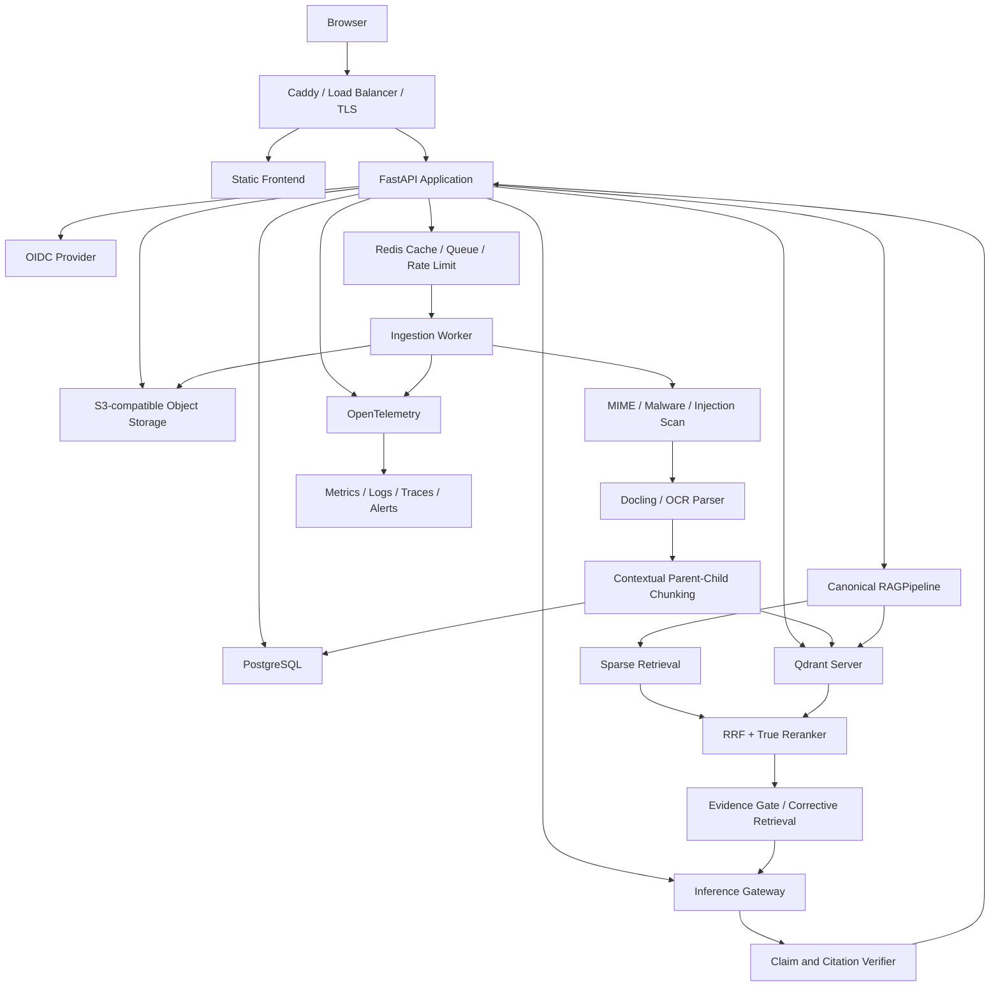

# Production-ready RAG 目標規格

日期：2026-07-26
專案：`IFRS17-RAG`
狀態：正式專案目標與驗收依據

## 1. 目標

將目前可在本機操作的 RAG 原型，升級成可以透過 HTTPS 對真實使用者提供服務的正式系統。

「可以直接上線」不是只有網站能開啟，而是同時符合：

- 使用者必須登入，且只能存取自己的資料。
- 上傳、解析、索引、查詢與刪除都有明確狀態及失敗處理。
- 回答能追溯到文件、版本、頁碼及原文。
- 服務可監控、可擴充、可備份、可還原、可安全更新。
- 任何程式改動都能透過自動測試判斷是否退化。
- 模型、向量庫或雲端供應商可以替換，不綁死單一平台。

## 2. 第一版上線規模

這是初始容量假設，用來讓架構與壓力測試有明確目標，未來可依實際使用量調整。

| 項目 | 第一版目標 |
|---|---:|
| 註冊使用者 | 100 人 |
| 同時在線使用者 | 20 人 |
| 同時生成回答 | 5 個，超出後排隊 |
| 單檔上限 | 50 MB |
| 單份 PDF 上限 | 200 頁 |
| 單一知識庫文件數 | 1,000 份 |
| 全系統 Chunk 數 | 100,000 個起步 |
| 部署區域 | 單一區域，資料每日備份 |

本機 Ollama 仍保留作為開發模式。正式公開環境必須使用具備足夠算力、併發限制與健康檢查的推論服務，例如獨立 GPU 主機上的 vLLM/Ollama，或相容的外部模型 API。

## 3. 上線 Definition of Done

以下 Gate 必須全部通過，才可稱為正式上線版。

### Gate A：功能

- 支援 PDF、IMAGE、DOCX、TXT、MD、JSON。
- 使用者可建立知識庫與資料夾，選擇哪些文件參與回答。
- 上傳採非同步處理，畫面可看到 `uploaded -> scanning -> parsing -> indexing -> ready`。
- 失敗文件可重試，不會留下半完成索引。
- 文件更新會建立新版本，舊版本可追蹤及回滾。
- 刪除文件時，原檔、Chunk、向量、快取與引用均同步失效。
- 對話、回饋與引用可追溯到同一次 `run_id`。

### Gate B：回答可靠度

- 正式 `/api/ask` 必須與 CLI、批次評測共用同一個 `RAGPipeline`。
- 正式 `/api/ask` 只接受問題、模型模式及已授權的 Knowledge Base/Document ID，不接受客戶端提供的 Context、分數或路由決策。
- 是否檢索、Query Rewrite、Hybrid Retrieval、Rerank、Evidence Gate、Generation、Citation Verification 都有可追蹤輸出。
- 找不到證據時會拒答，不使用模型常識補寫文件中的事實。
- 每個可驗證主張都能對應來源、文件版本、頁碼或段落。
- 有衝突資料時呈現衝突，不靜默選擇其中一份。
- 時間、日期、計算等非文件問題使用確定性工具處理。

### Gate C：安全與資料隔離

- 支援 OIDC/OAuth2 登入，API 驗證短效 JWT。
- 每個資料實體均有 `tenant_id`、`owner_id` 或明確共享權限。
- PostgreSQL 查詢與 Qdrant Filter 都強制帶入 `tenant_id`。
- 原始檔使用私有 Object Storage，不提供永久公開網址。
- 下載使用短效 Signed URL，並先檢查使用者權限。
- 驗證實際 MIME、大小、頁數、壓縮率與檔案內容。
- 文件先掃描惡意內容及 Prompt Injection，再進解析流程。
- 檢索文字在 Prompt 中明確標示為不可信資料，不能覆蓋 System Prompt。
- Secrets 不進 Git、不寫入前端、不出現在錯誤訊息或 Log。
- API 有 Rate Limit、Request Size Limit、Timeout 與併發上限。
- 所有敏感操作寫入不可由一般使用者修改的 Audit Log。

### Gate D：部署與維運

- 所有服務可透過 Docker Compose 在乾淨主機啟動。
- Production 依賴有固定版本及 Lockfile。
- Database Migration 使用 Alembic，不在啟動時臨時修改 Schema。
- 提供 `/health/live`、`/health/ready` 與依賴服務檢查。
- 使用結構化 JSON Log、Correlation ID 與 OpenTelemetry Trace。
- 監控 API 錯誤率、延遲、Queue 深度、索引失敗、模型失敗及資源使用量。
- PostgreSQL、Object Storage 與 Qdrant 有備份及實際還原演練。
- 部署失敗可回滾前一個應用版本與前一個可用索引版本。

### Gate E：自動驗證

- Unit tests：切塊、路由、權限、過濾、引用、資料狀態。
- Integration tests：PostgreSQL、Qdrant、Redis、Object Storage、模型 Stub。
- End-to-end tests：登入、上傳、完成索引、問答、引用、刪除。
- Retrieval eval：Recall@K、MRR、nDCG、Context Precision。
- Answer eval：Faithfulness、完整性、Claim/Citation Precision、拒答。
- Security tests：跨租戶、路徑穿越、惡意檔案、Prompt Injection、權限繞過。
- Load tests：20 位同時在線、5 個同時生成、Queue Backpressure。
- Recovery test：資料庫、物件與向量索引可從備份還原。

## 4. 目標架構



## 5. 技術選型

| 層級 | 第一版選型 | 原因 |
|---|---|---|
| API | FastAPI + Uvicorn/Gunicorn | 支援驗證、非同步 API、OpenAPI、Middleware 與正式 ASGI Server |
| Metadata DB | PostgreSQL + SQLAlchemy + Alembic | 多使用者、交易、權限、Migration 與備份成熟 |
| Vector DB | 獨立 Qdrant Server | 支援持久化、Payload Filter、Snapshot 與水平擴充 |
| Object Storage | S3 或 MinIO | 原檔與解析產物不綁應用主機磁碟 |
| Queue | Redis + Celery | 大型文件非同步匯入、重試、Timeout 與 Backpressure |
| Parser | Docling + OCR fallback | 保留版面、表格、閱讀順序、頁碼與多格式結構 |
| Sparse Search | PostgreSQL FTS 或獨立 BM25 Index | 不再於每個 Web Process 各建一份記憶體索引 |
| Model | Inference Gateway Adapter | 可切換 Ollama、vLLM 或外部模型 API |
| Auth | OIDC/OAuth2 + JWT | 不自行保存密碼，支援未來企業 SSO |
| Edge | Caddy 或受管 Load Balancer | HTTPS、安全 Header、壓縮與反向代理 |
| Observability | OpenTelemetry + Prometheus/Grafana + JSON Log | 統一追蹤 API、Worker、檢索與模型延遲 |

第一版先以 Docker Compose 部署到單一 VM，不先導入 Kubernetes。只有當單機容量、可用性或多區需求真的不足時再升級編排平台。

## 6. 核心資料模型

正式版至少需要以下實體：

```text
Tenant
User
Membership / Role
KnowledgeBase
Folder
Document
DocumentVersion
IngestionJob
Chunk
IndexVersion
Conversation
Message
AnswerRun
Citation
Feedback
AuditEvent
```

必要規則：

- `Document` 是使用者看見的邏輯文件，內容更新產生 `DocumentVersion`。
- `Chunk` 必須指向 `DocumentVersion`，不能只記檔名。
- `AnswerRun` 記錄 Pipeline、模型、Prompt、索引版本及所有時間。
- `Citation` 指向實際 Chunk、頁碼、原文範圍與版本。
- 所有業務資料必須能沿關係追溯到 `tenant_id`。
- Qdrant Payload 至少保存 `tenant_id`、`knowledge_base_id`、`document_version_id`、`chunk_id`。

## 7. 文件匯入狀態機

```text
uploaded
  -> scanning
  -> parsing
  -> chunking
  -> embedding
  -> indexing
  -> validating
  -> ready
```

任何階段失敗都進入 `failed`，保存安全的錯誤代碼與可重試狀態。只有 `ready` 的文件能被查詢。

新版本索引完成前，舊版本繼續提供服務。驗證通過後再原子切換 `active_index_version`，避免使用者查到半完成資料。

## 8. 正式問答 Pipeline

```text
Authenticate and authorize
-> Resolve tenant and selected knowledge bases
-> Classify no-retrieval / simple / multi-hop
-> Rewrite or decompose only when needed
-> BM25 + Dense retrieval with mandatory tenant filters
-> RRF merge
-> True reranker
-> Deduplicate and dynamic evidence budget
-> Evidence sufficiency gate
-> Generate grounded answer
-> Claim and citation verification
-> Persist AnswerRun and audit metadata
-> Stream answer and evidence links to client
```

所有入口只能呼叫這一條 Pipeline。網頁、CLI、批次評測及未來 API Client 不得各自複製判斷邏輯。

## 9. SLO 與品質門檻

### 服務 SLO

| 指標 | 第一版目標 |
|---|---:|
| 月可用性 | 99.5% |
| API 非模型錯誤率 | 小於 1% |
| `/health/live` P95 | 200 ms 內 |
| 上傳接受回應 P95 | 2 秒內，解析在背景執行 |
| Retrieval P95 | 2 秒內，100,000 Chunks 基準 |
| 第一個進度事件 | 500 ms 內 |
| Fast 模式完整回答 P95 | 30 秒內，依正式推論硬體驗證 |
| 備份 RPO | 24 小時 |
| 還原 RTO | 4 小時 |

### RAG 品質 Gate

| 指標 | 上線門檻 |
|---|---:|
| 該檢索問題的 Routing Recall | 至少 95% |
| Citation Precision | 至少 95% |
| 無答案題錯誤作答率 | 低於 5% |
| 跨租戶資料洩漏 | 0 件 |
| 支援格式端到端成功率 | 100% 通過固定回歸樣本 |
| 新版本相對 Baseline | 不得降低精準事實題，模糊與跨文件題需有可量測改善 |

這些數字先由正式 Pipeline 建立 Baseline，再依真實流量調整，但資料隔離與權限 Gate 不得降低。

## 10. 原始 P0 與目前處置

下表保留原始風險，並以 2026-07-26 最新工作樹重新判定：

| 原始阻擋 | 目前處置 | 狀態 |
|---|---|---|
| 開發用 `ThreadingHTTPServer` | 新增 FastAPI/Uvicorn Production App；舊 Demo Server 不作正式入口 | 已實作 |
| 無登入、授權、租戶隔離 | OIDC/JWT、PKCE、Redis Web Session、PostgreSQL/Qdrant Tenant Filter | 已實作，待真實 OIDC E2E |
| SQLite 與本機共用資料 | PostgreSQL、Qdrant Server、S3-compatible Object Storage、Redis | 已實作，待 Compose E2E |
| 同步匯入 | Upload Session + Celery Worker + Lease/Heartbeat/Retry | 已實作 |
| 記憶體 Dense Index | Qdrant Dense + Sparse、RRF、Reranker、Tenant Payload Filter | 已實作 |
| 無 Lock/Docker/Compose/CI | 固定依賴、雙 Dockerfile、Compose、GitHub Actions | 已實作，待正式 Commit/Tag 與 CI 真實執行 |
| 假 Health | Liveness、Readiness 與 DB/Redis/Qdrant/S3/模型/Worker Heartbeat | 已實作 |
| 洩漏內部錯誤 | 穩定 Error Code、Request ID、Server-side JSON Log | 已實作 |
| 多套 Pipeline | Production API、CLI 與 Canonical Eval 共用 Server-side `RAGPipeline` | 已實作 |
| 無 Migration/Audit/Metrics | Alembic、Audit Event、Prometheus 指標、Correlation ID | 部分完成；OpenTelemetry/Alert 尚待部署 |
| 無惡意檔案與 Injection 防護 | MIME/大小/SHA、ClamAV、Prompt Injection Quarantine | 已實作，待真實惡意樣本 E2E |
| 客戶端可偽造 Evidence | `/v1/ask` 只接受問題、授權 KB/Source ID 與模型 | 已實作 |
| 可變索引與半發布 | Immutable Manifest、內容指紋、驗證、CAS 原子發布、延遲 GC | 已實作；舊索引回滾介面待補 |
| 無備份還原 | Cold Backup/Restore Script + SHA-256 | 已實作，待空白主機演練 |

因此目前定位是 `Staging Candidate`。程式層的原始 P0 大多已處理，但在真實部署環境完成 OIDC、Container、Load、Recovery、Rollback 與安全測試前，仍不得標記 Production `GO`。

## 11. 實作階段

### Phase 0：凍結 Baseline

- 保留目前可用版本，不直接在舊 Handler 上堆疊 production middleware。
- 將目前要保留的程式、測試、設定與資料 Manifest 納入可重現的乾淨版本。
- 建立正式 Gold Set 與目前 `/api/ask` 的 Baseline。
- 抽出單一 `RAGPipeline`，Web、CLI、Eval 共用。
- 收緊 `/api/ask` Contract，不再信任客戶端 Context、分數及路由決策。

### Phase 1：Production Skeleton

- 建立 FastAPI Application、設定模型與依賴注入。
- 建立 PostgreSQL Schema、Alembic Migration、OIDC Auth 與 tenant enforcement。
- 建立 Qdrant Server、Object Storage、Redis/Celery。
- 加入 Docker Compose、Health、JSON Log、Trace 與 GitHub Actions。

### Phase 2：安全匯入 Pipeline

- 上傳先存 Object Storage，再建立非同步 Job。
- 導入安全掃描、Docling、OCR、Canonical Document JSON。
- 實作版本化 Chunk 與 Index 的原子發布、重試及刪除。

### Phase 3：正式 Retrieval 與 Answer Verification

- True Reranker、動態 Top-K、去重、Corrective Retrieval。
- Claim-level Citation、版本衝突、拒答與 Evidence Trace。
- 建立 Fast、Auto、Accurate 三種資源策略。

### Phase 4：上線驗證

- 執行 E2E、Security、Load、Recovery 與 RAG Eval。
- 完成 Runbook、Incident Playbook、Backup/Restore 與 Rollback 演練。
- Staging 通過所有 Gate 後，才部署 Production。

## 12. 第一個施工切點（已完成）

第一個程式變更為：

> 建立不依賴 HTTP 的單一 `RAGPipeline`，讓現有 `/api/ask`、CLI 與批次評測全部呼叫它，並先保存完全相同的行為。

`RAGPipeline` 已由伺服器執行路由、檢索、Evidence Gate 與引用，不接受瀏覽器製造的證據。後續上線與驗收流程見 [Production Runbook](production-runbook.md)。
