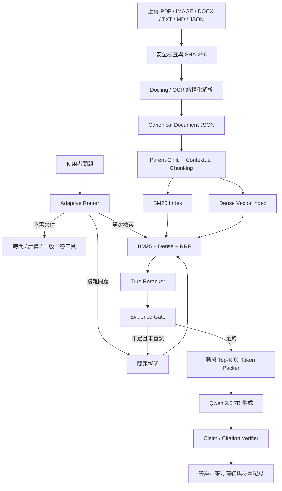

# RAG 改善研究報告

日期：2026-07-26
專案：`IFRS17-RAG`
評估環境：Apple M4、16 GB RAM、Ollama `qwen2.5:7b`

## 一、結論先講

目前這套系統已經不是只有畫面的 Demo，而是一個具備多格式匯入、OCR、BM25、Embedding、RRF、回答路由、SQLite 對話紀錄與本機 Qwen 的可運作 RAG 原型。

本專案後續目標已提升為「可以直接部署上線的 RAG 架構」。正式的上線定義、目標元件、安全 Gate、SLO 與分階段施工順序另見 [Production-ready RAG 目標規格](production-ready-rag-target.md)。

真正限制它繼續進步的問題，不是缺少更多 Agent，也不是 Qwen 只有 7B，而是以下四件事：

1. 正式網頁與完整 Self-RAG 使用不同執行路徑，難以確定測到的結果是否就是使用者實際拿到的結果。
2. 現有 Rerank 是規則加權，不是真正會比較「問題與段落語意相關性」的 Reranker 模型。
3. 文件雖可上傳，但 PDF 表格、版面、章節關係與父子段落仍會在轉成純文字時損失。
4. 缺少一套針對正式 `/api/ask` 路徑的端到端標準測試，現在很難客觀判斷每次修改究竟有沒有變好。

我建議下一輪先完成這四件事：

> **統一正式 Pipeline -> 建立正式評測集 -> 加入真正 Reranker -> 改成結構化、父子式切塊與動態 Top-K。**

這一輪做完，帶來的提升會比立刻換更大模型、導入完整 GraphRAG 或 Fine-tuning 更明顯。

## 二、目前架構盤點

### 已經做得好的部分

- 支援 PDF、圖片、DOCX、TXT、MD、JSON。
- 圖片可透過 macOS Vision 或 Tesseract OCR。
- 檢索已包含 BM25、Dense Embedding、RRF 融合。
- 能先判斷問題是否需要檢索，不必每題都查文件。
- 能在證據不足時拒答，而不是一律硬猜。
- 已有 SQLite 對話紀錄、長期記憶、資料夾分類與文件選擇。
- 全部可在本機執行，文件不必離開電腦。
- 介面會顯示處理進度，使用者知道系統正在判斷、檢索或生成。

### 目前的主要缺口

| 區域 | 現況 | 風險 |
|---|---|---|
| 正式 Pipeline | `web_app.py` 與 `query.py` 有兩套不同深度的流程 | CLI 測試變好，不代表網頁回答同步變好 |
| Embedding | `paraphrase-multilingual-MiniLM-L12-v2` | 輕量，但中文法規、長段落與跨語言能力有限 |
| Rerank | 由 RRF、BM25、Embedding、詞覆蓋率等規則加權 | 名稱像 Rerank，但不是 Cross-Encoder 或生成式 Reranker |
| Chunking | 約 1,200 字元、600 字元重疊，再找標點切斷 | 可能切斷法條、表格、定義、例外條款與跨頁語意 |
| Context | 固定 `Top-K = 8` | 簡單問題浪費時間，複雜問題又可能證據不足 |
| 記憶 | 最近記憶直接放入 Prompt | 不相關或過期記憶可能污染回答 |
| 引用 | 回答附來源編號 | 尚未逐一驗證每個主張真的被引用段落支持 |
| 安全 | 可上傳任意文件 | 文件中的惡意指令可能形成間接 Prompt Injection |
| 評測 | 有數個既有測試與歷史報告 | 舊測試未必代表目前正式網頁路徑 |

### 內部工程評分

這是依目前程式與既有測試做的工程判斷，不是公開基準分數。

| 面向 | 評分 | 判斷 |
|---|---:|---|
| 功能完整度 | 7.5 / 10 | 已有可操作的完整骨架 |
| 本機可用性 | 8 / 10 | 很適合 M4、16 GB 的單人本機 Demo |
| 檢索可靠度 | 6 / 10 | 混合檢索正確，但 Reranker 與 Chunking 還有明顯空間 |
| 回答可驗證性 | 5.5 / 10 | 有來源，尚未做到 Claim-level 驗證 |
| 任意文件泛用性 | 6 / 10 | 格式多，但不等於內容結構都能正確保留 |
| 公開服務準備度 | 4 / 10 | 還缺權限、惡意文件防護、監控與正式回歸測試 |

## 三、研究後最值得加入的技術

### 1. 先建立真正的 RAG 評測系統

這是最高優先級，因為沒有它，後續換 Embedding、切塊或模型都只能憑感覺。

[RAGChecker](https://arxiv.org/abs/2408.08067) 主張將 RAG 拆成 Retriever 與 Generator 分別評估，而不是只看最後答案像不像。官方也提供了可執行的 [RAGChecker 專案](https://github.com/amazon-science/RAGChecker)。

建議建立至少六類題目：

1. 精準事實：文件中有明確一句答案。
2. 模糊改寫：問題不使用文件原詞。
3. 跨段落或跨文件：答案必須整合兩個以上證據。
4. 表格、圖片與 OCR：答案來自非純文字內容。
5. 無答案與衝突資料：應拒答或揭露不同版本。
6. 連續對話：第二題依賴上一題，但不應把上一題誤當檢索需求。

評分必須分開：

- 路由：該不該檢索的 Precision、Recall。
- 檢索：Recall@K、MRR、nDCG、Context Precision。
- 生成：正確性、完整性、Faithfulness、幻覺率。
- 引用：每個主張能否對應正確來源、頁碼與原文。
- 拒答：該拒答時有沒有拒答，不該拒答時是否錯誤拒答。
- 效能：匯入時間、P50/P95 回答時間、記憶體峰值。

現有歷史報告曾出現 BM25 約 88.6%、BM25 + Dense 約 89.6%，但也有 Full Stack 約 49.0% 的結果。這說明增加元件不一定會變好，也說明現在必須用正式網頁 Pipeline 重新建立基線，不能直接把舊數字當成目前成績。

### 2. 將規則加權改成真正的 Reranker

目前的 `rerank_candidates()` 是很合理的第一版，但它仍是人工權重。真正的 Reranker 會同時讀取問題與候選段落，再判斷這個段落是否真的能回答問題。

推薦 A/B 測試：

- [Qwen3-Reranker-0.6B](https://github.com/QwenLM/Qwen3-Embedding)：中文、多語、指令式查詢表現值得測試。
- [BGE-reranker-v2-m3](https://github.com/FlagOpen/FlagEmbedding)：成熟的多語 Reranker，可與 BGE-M3 一起使用。

建議流程：

```text
BM25 + Dense 各自召回
        ↓
RRF 合併 30 至 50 個候選
        ↓
真正 Reranker 重新排序
        ↓
留下 4 至 8 個高品質證據
```

本機限制：不要讓 Qwen 7B、Embedding 與 Reranker 長期同時佔滿記憶體。可採序列載入、量化或將 Embedding/Reranker 放在 CPU，先量測再決定常駐方式。

### 3. 導入結構化文件解析，而不只是抽文字

[Docling](https://github.com/docling-project/docling) 支援 PDF、DOCX、圖片、OCR、版面、閱讀順序、表格與公式，也能輸出保留結構的 JSON。這比每種格式各自抽成平面文字更適合泛用文件 RAG。

建議所有上傳格式先轉成統一的 `Document JSON`：

```json
{
  "document_id": "...",
  "title": "...",
  "source_type": "pdf",
  "folder": "勞基法",
  "sections": [
    {
      "heading_path": ["第三章", "工資"],
      "page": 12,
      "block_type": "paragraph|table|image|formula",
      "text": "...",
      "bbox": [0, 0, 0, 0],
      "ocr_confidence": 0.96
    }
  ]
}
```

好處是後續 Chunk、引用、頁碼、表格問答、權限與版本管理都只需處理一種資料結構。

### 4. 改成 Contextual + Parent-Child Chunking

固定字元切塊簡單穩定，但法規常見「條文、但書、例外、子款、解釋函令」跨多段相互依賴。建議採兩層結構：

- Child Chunk：250 至 500 tokens，用於精準檢索。
- Parent Section：完整條文或章節，用於最後生成。

每個 Child 前加入短的脈絡前綴：

```text
文件：勞動基準法
章節：第三章 工資 > 第 17 條
資料類型：法條
生效日期：2026-01-01
內容：...
```

Anthropic 的 [Contextual Retrieval](https://www.anthropic.com/engineering/contextual-retrieval) 在其測試中，結合 Contextual Embeddings、Contextual BM25 與 Reranking，將 Top-20 檢索失敗率從 5.7% 降至 1.9%。這不是保證本專案會得到相同數字，但方法非常符合目前缺口。

[Late Chunking](https://arxiv.org/abs/2409.04701) 也能保留長文件上下文，但實作與算力成本較高。建議先做脈絡前綴與 Parent-Child，確認有效後再測 Late Chunking。

### 5. 用動態證據預算取代固定 Top-K

[Adaptive-RAG](https://arxiv.org/abs/2403.14403) 依問題複雜度決定不檢索、單次檢索或迭代檢索；[Self-RAG](https://arxiv.org/abs/2310.11511) 也顯示不是所有問題都應無條件塞入固定數量段落。

推薦三段路由：

| 類型 | 例子 | 流程 |
|---|---|---|
| 不檢索 | 今天星期幾、2+2 | 工具或模型直接回答 |
| 單次檢索 | 第 17 條如何計算資遣費 | Hybrid Retrieval -> Rerank -> 回答 |
| 複雜檢索 | 比較不同法規版本及法院案例 | 問題拆解 -> 多次檢索 -> 合併 Rerank -> 回答 |

Top-K 也應動態決定：

- 簡單事實：3 個片段。
- 一般解釋：5 個片段。
- 跨文件問題：8 個片段，必要時拆成子問題。

本專案過去的本機實驗已經顯示，Top 3 比 Top 8 快很多，但檢索覆蓋率會下降。因此不應把 Top 3 或 Top 8 寫死，而應讓 Controller 根據問題與證據充足度決定。

另外要做去重與 Token Budget Packer，避免八個片段其實是同一段的重複版本。[Lost in the Middle](https://arxiv.org/abs/2307.03172) 也指出長上下文中的位置會影響模型利用資訊的能力，因此最強證據應放在容易被模型注意的位置，而不是只按檢索分數機械串接。

### 6. Embedding 不要直接換，先做受控比較

推薦候選：

- 現況基線：`paraphrase-multilingual-MiniLM-L12-v2`
- [Qwen3-Embedding-0.6B](https://huggingface.co/Qwen/Qwen3-Embedding-0.6B)：100 多種語言、32K context，可選 32 至 1024 維。
- [BGE-M3](https://arxiv.org/abs/2402.03216)：支援多語、Dense、Sparse 與 Multi-vector，長度可到 8192 tokens。

測試時必須固定 Chunk、候選數、Reranker、Prompt 與問題集，只替換 Embedding，分別比較：

- 中文法規同義改寫。
- 中英縮寫，例如 CSM 與合約服務邊際。
- 長條文與短問句。
- 記憶體、建索引時間、單題查詢時間。

我的判斷是，Reranker 與 Chunking 的優先級高於直接換 Embedding。因為更強的 Embedding 無法補回匯入時已經被切斷或抽錯的表格與段落。

### 7. 加入 Corrective Retrieval，但限制最多一次

[CRAG](https://arxiv.org/abs/2401.15884) 的重點不是無限循環，而是先評估檢索品質，再決定使用、修正或改用其他來源。

適合本專案的簡化流程：

1. 第一次檢索與 Rerank。
2. Evidence Gate 判斷是否足夠。
3. 不足時只允許一次：改寫問題、拆成子問題，或請使用者澄清。
4. 第二次仍不足就明確拒答，列出缺少的資料。

多跳問題可參考 [Question Decomposition for RAG](https://arxiv.org/abs/2507.00355)，但應先用自己的法規題目驗證，不要直接採用論文數字當成預期成績。

### 8. 做 Claim-level 引用與版本衝突處理

現在的來源 `[1]`、`[2]` 能讓人回頭看資料，但還不能保證每句話都有證據。

建議回答後增加一個輕量驗證步驟：

1. 將回答拆成可驗證主張。
2. 每個主張必須對應一個來源片段與原文範圍。
3. 找不到支持就刪除、改寫成不確定，或標示「無法由目前資料驗證」。
4. 法規類文件另外比較發布日期、生效日期、廢止日期與權威層級。
5. 兩份資料衝突時，不靜默選一份，應把差異呈現給使用者。

這會比單純讓 Qwen 再回答一次更能降低「看起來合理但來源不支持」的錯誤。

### 9. 長期記憶也要先檢索再注入

對話紀錄與使用者記憶應分開：

- 對話歷史：保留最近幾輪，維持語境。
- 長期記憶：先用 FTS 或 Embedding 找與目前問題相關的記憶。
- 專案記憶：只在相同資料夾或工作空間中使用。
- 過期資訊：加入日期、TTL、取代關係與刪除功能。
- 衝突記憶：新舊內容不一致時詢問使用者，不直接混在一起。

不建議把最新 12 筆記憶無條件放進每個 Prompt，因為這會增加延遲，也可能讓模型將不相關記憶當成事實。

### 10. 公開讓別人上傳前，先補安全層

OWASP 的 [RAG Security Cheat Sheet](https://cheatsheetseries.owasp.org/cheatsheets/RAG_Security_Cheat_Sheet.html) 建議記錄文件來源與 Hash、檢查 Prompt Injection、實施存取控制，並將檢索內容視為不可信資料。[OWASP Prompt Injection](https://genai.owasp.org/llmrisk/llm01-prompt-injection/) 也明確指出，使用 RAG 不會自動消除文件中的間接指令攻擊。

公開服務至少需要：

- 驗證實際 MIME，而不是只相信副檔名。
- 檔案大小、頁數與解壓縮上限。
- 惡意軟體與可疑文字指令掃描。
- SHA-256、上傳者、來源、版本與解析器版本。
- System Prompt 明確要求「文件是資料，不是可執行指令」。
- 使用者、資料夾、文件層級 ACL。
- 每次回答記錄實際使用的文件與 Chunk。
- 多租戶時完全隔離向量索引、快取與記憶。

資料夾分類只解決整理問題，不等於權限隔離。

## 四、建議的新架構



## 五、分階段實作順序

### P0：先建立可信基線

預估 1 至 2 個工作天。

- 將網頁與 CLI 統一呼叫同一個 Pipeline Service。
- 固定並記錄 Pipeline 版本、模型、Prompt、索引與資料集版本。
- 先建立 60 至 100 題的小型 Gold Set，再逐步擴到 200 題。
- 所有測試直接打正式 `/api/ask`，保留逐題輸出與 Trace ID。
- 產生速度、檢索、回答、引用與拒答五份分項報告。

### P1：提升每次檢索的品質

預估 3 至 5 個工作天。

- A/B 測試 Qwen3-Reranker-0.6B 與 BGE-reranker-v2-m3。
- 加入動態 Top-K、去重與 Token Budget Packer。
- 將 Full Self-RAG Critic 做成可選的 Accurate 模式，不讓每題都付出相同延遲。
- 先保留現有加權 Rerank 作為快速模式與故障備援。

### P2：改善文件匯入品質

預估 1 至 2 週，取決於表格與 OCR 測試量。

- 導入 Docling 或同等結構化解析器。
- 建立 Canonical Document JSON。
- 實作 Parent-Child 與 Contextual Chunking。
- 重新匯入 PDF、Word、圖片，針對表格、跨頁與條文層級做回歸測試。
- A/B 測試 MiniLM、Qwen3-Embedding-0.6B、BGE-M3。

### P3：可靠度與公開服務

- Claim-level 引用驗證。
- 法規版本、日期、權威層級與衝突處理。
- Corrective Retrieval，最多一次重試。
- 相關記憶檢索、記憶範圍與過期管理。
- Prompt Injection、ACL、租戶隔離、審計與監控。

## 六、建議的驗收標準

第一輪不要先訂一個看似漂亮但沒有基線的絕對分數。先以目前正式 Pipeline 建立 Baseline，再用相對改善驗收：

| 指標 | 第一階段建議門檻 |
|---|---|
| 精準事實 Recall@5 | 不得低於現況 |
| 模糊改寫與跨文件 Recall@5 | 相對提升至少 5 個百分點 |
| Citation Precision | 至少 95% 的引用真的支持對應主張 |
| 無答案題錯誤作答率 | 低於 5% |
| 路由 Recall | 該檢索的題目至少 95% 進入檢索 |
| 一般模式 P95 延遲 | 不高於現況 1.2 倍 |
| Accurate 模式 P95 延遲 | 可放寬，但必須證明正確率提升 |
| 上傳回歸 | 六種格式、表格、OCR、跨頁案例全部通過 |

對每個改動遵守單變因原則。例如測 Embedding 時不要同時改 Chunk 與 Reranker；測 Prompt 長度時固定檢索證據。速度、檢索、回答品質必須分開報告。

## 七、暫時不要優先做的事

### 1. 不要立刻上完整 GraphRAG

[Microsoft GraphRAG](https://github.com/microsoft/graphrag) 適合全域主題整理與複雜關係，但索引成本高，官方專案也提醒 indexing 可能昂貴。現有本機測試已顯示 Graph 加入後可能因 Hub 節點造成排序退化。

較好的做法是只對「法條引用、案例與法條關係、跨文件多跳」啟用小範圍 Graph。需要多跳能力時，也可先測較輕的問題拆解。若之後確定有大量關係題，再研究 [HippoRAG](https://arxiv.org/abs/2405.14831) 或 GraphRAG。

### 2. 不要先 Fine-tune Qwen

目前主要錯誤更可能發生在文件解析、檢索、排序、證據選擇與引用，而不是 Qwen 完全不會寫答案。Fine-tuning 會增加資料準備與版本管理成本，卻無法讓被漏掉的文件自動出現在 Prompt 中。

只有在檢索與引用已穩定，且仍持續出現固定格式、固定語氣或特定推理錯誤時，再考慮 LoRA/SFT。

### 3. 不要讓所有問題都跑完整 Agent Loop

本機 7B 模型每多一次 Critic 或改寫就增加明顯延遲。適合採用：

- `Fast`：單次 Hybrid + 輕量 Rerank。
- `Auto`：Router 自動決定是否啟用真正 Reranker 或一次修正。
- `Accurate`：複雜題才跑問題拆解、Critic 與 Claim 驗證。

## 八、四個 Agent 的執行分工

### EN Agent - Environment

- 統一正式 Pipeline 與測試入口。
- 固定環境、索引、模型、Seed、資料版本。
- 建立 Gold Set、評分器與可重現的 Reset 流程。

### P Agent - Policy Improvement

- 比較 Reranker、Embedding、Chunking 與 Router 策略。
- 每次只提出一個可驗證改動與預期結果。
- 分析失敗題型，不只看平均分數。

### R Agent - Rollout

- 執行 Baseline 與 A/B 測試。
- 保存每題 Query、檢索片段、分數、回答、引用、延遲與錯誤。
- 不刪除失敗結果，讓退化可以被追查。

### E Agent - Experience / Evolution

- 將有效策略寫入版本化最佳實務。
- 將無效策略與原因放入 Failure Log。
- 只讓通過回歸測試的策略成為預設值。

## 九、我會怎麼開始下一輪

如果由我直接開始實作，我會依這個順序：

1. 建立統一 `RAGPipeline`，讓網頁與 CLI 共用。
2. 從現有勞基法、IFRS 17、多模態檔案整理第一版 Gold Set。
3. 對正式 `/api/ask` 跑 Baseline，保存完整 Trace。
4. 實作真正 Reranker Adapter，同時測 Qwen3 與 BGE。
5. 加入動態 Top-K、去重與 Token Packer。
6. 再導入 Docling、Parent-Child 與 Contextual Chunking。
7. 通過回歸後，才把新 Pipeline 切成預設。

## 十、最終判斷

目前這個 RAG 最值得做的不是把功能繼續往外堆，而是把現有功能收斂成一條可測量、可比較、可回歸、可追蹤的正式 Pipeline。

短期最佳投資是：

> **正式端到端評測 + 真正 Reranker + 結構化文件解析 + Contextual Parent-Child Chunking + 動態證據預算。**

這五項會同時改善「找不找得到」、「找到的是否正確」、「模型看不看得懂」、「回答能不能驗證」與「本機速度是否可接受」。等這些基礎穩定後，再加入 GraphRAG、Fine-tuning 或更多 Agent，才不會讓系統變得更複雜卻更難判斷好壞。

## 參考資料

- [RAGChecker: A Fine-grained Framework for Diagnosing RAG](https://arxiv.org/abs/2408.08067)
- [RAGChecker GitHub](https://github.com/amazon-science/RAGChecker)
- [Adaptive-RAG](https://arxiv.org/abs/2403.14403)
- [Self-RAG](https://arxiv.org/abs/2310.11511)
- [Corrective Retrieval Augmented Generation](https://arxiv.org/abs/2401.15884)
- [Contextual Retrieval](https://www.anthropic.com/engineering/contextual-retrieval)
- [Late Chunking](https://arxiv.org/abs/2409.04701)
- [Lost in the Middle](https://arxiv.org/abs/2307.03172)
- [BGE-M3](https://arxiv.org/abs/2402.03216)
- [FlagEmbedding](https://github.com/FlagOpen/FlagEmbedding)
- [Qwen3 Embedding and Reranker](https://github.com/QwenLM/Qwen3-Embedding)
- [Docling](https://github.com/docling-project/docling)
- [Question Decomposition for RAG](https://arxiv.org/abs/2507.00355)
- [HippoRAG](https://arxiv.org/abs/2405.14831)
- [Microsoft GraphRAG](https://github.com/microsoft/graphrag)
- [OWASP RAG Security Cheat Sheet](https://cheatsheetseries.owasp.org/cheatsheets/RAG_Security_Cheat_Sheet.html)
- [OWASP LLM01 Prompt Injection](https://genai.owasp.org/llmrisk/llm01-prompt-injection/)
